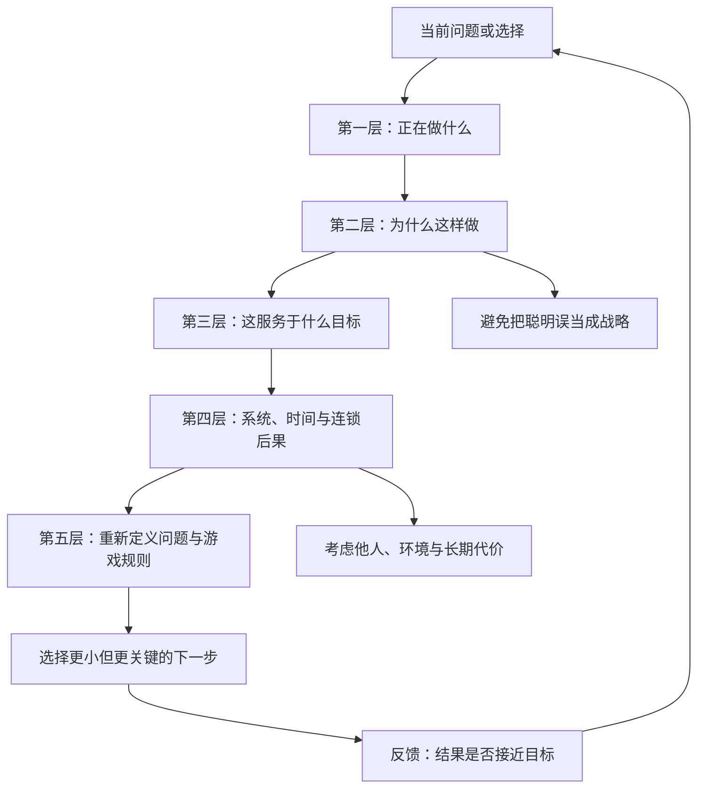

# How To Think Like A Strategic Genius（五维思考）

## 一句话总结

战略思考不是把自己变得更聪明，而是把视角从眼前动作逐级抬高，识别更完整的系统、选择与后果，再用它们指导当前行动。

## 来源信息

- 频道：Dan Koe
- 链接：https://www.youtube.com/watch?v=TY8IVSQnwlk
- 发布：2026-02-22 16:58 UTC（YouTube RSS）
- 学习日期：2026-06-21
- 字幕依据：未能恢复可用的公开视频字幕；以下内容仅依据官方 RSS 中的简介和章节，置信度低。
- 官方简介：`How to think better: notice when you think stupidly and stop it.`（如何更好地思考：察觉自己何时在进行糟糕思考，并停止它。）
- 章节：`0:00 Intelligence doesn't equal success`、`9:12 Altitudes, levels, and lines of thinking`、`17:04 How to unlock 4-dimensional thinking`、`21:20 How to tap into the 5th dimension`、`29:52 We missed something important`。

## 核心观点

1. 智力并不自动带来成功；视频开头明确把两者区分开，暗示关键在于思考的方向与层次，而不只是知识或反应速度。
2. “高度、层级和思考线”是全片框架：同一问题可从不同高度观察，低层动作需要接受更高层目标和约束的校正。
3. 视频以“四维”和“五维”作为后半段重点。由于没有逐字稿，不能把它们当作已验证的固定定义；可确定的是，作者主张从单点判断走向多层、长期的战略视角。

## 视觉知识信息图（NotebookLM 风格）

## 详细学习笔记

### 1. 问题背景：聪明为什么不等于成功

章节 `Intelligence doesn't equal success` 与官方简介共同指出一个有用的起点：一个人即使分析快、信息多，也可能把精力投入到不值得赢的事情上。这里的关键不是“多想”，而是先识别自己正在用哪一种角度思考。若目标本身不清楚，或只看短期反馈，聪明会提高执行效率，却未必提高结果质量。

### 2. 关键机制：从动作高度切换到目标高度

`Altitudes, levels, and lines of thinking` 表明作者把思考区分为不同高度。可把它转成一个实际检查法：先写下当前动作，再向上追问“它解决什么问题”“那个问题服务于什么目标”，最后向外问“系统会怎样回应”。这不是为了制造复杂度，而是防止在错误的局部优化上投入更多力气。

### 3. 方法步骤：用多维检查改写一个决策

以下步骤是依据章节结构整理出的学习用工作流，不是对视频逐字内容的复述：

1. 选一个正在犹豫的具体决策，例如是否接一个项目、投入一个内容方向或学习一项技能。
2. 写清第一层：我现在准备做什么，以及它的直接收益和代价。
3. 向上追问两次：它真正解决的问题是什么？这与我想要的长期结果有什么关系？
4. 向外扩展：三个月后、相关的人或市场发生反应后，哪些连锁后果最可能出现？
5. 尝试第五层的重述：如果不把当前方案当成唯一方案，问题是否应该被改写？
6. 只保留一个能在本周验证的下一步，并记录结果来更新判断。

### 4. 边界与验证

“四维思考”和“五维思考”的具体定义、案例和作者提出的“遗漏的重要事项”，在公开章节中没有展开。本笔记不应被当作该视频的完整转录，也不应据此把“维度”理解为严格的心理学或科学模型。需要精确引用时，应观看原视频或取得字幕后补充核对。

### 5. 我的理解

这个框架的实际价值在于给思考加一个刹车：当我很快得出答案时，先检查那是不是只对眼前动作有效。战略不是每件事都考虑五层，而是在高代价、难反悔的选择前，主动把问题抬高一次，并允许自己发现“我原来问错了”。

## 可执行行动

- [ ] 选一个本周的重要决定，写下“动作—目的—长期目标”三层，不超过 10 分钟。
- [ ] 为该决定列出两个三个月后可能发生的连锁后果，并写下各自的早期信号。
- [ ] 把原问题改写成一个更高层的问题，再比较两种问法是否导向不同的下一步。

## 可拆分的原子笔记建议

- [[聪明不等于战略]]
- [[用思考高度校正局部优化]]
- [[高代价决策的多层检查]]
- [[重新定义问题比加速解题更重要]]

## 与我的系统连接

- 内容创作：把选题从“今天发什么”抬高到“它是否服务于长期主题与受众问题”。
- 一人公司：在新项目开始前检查它是否改善长期目标，而不是只追逐短期收入或新鲜感。
- 学习系统：把学习目标与实际项目相连，避免只积累零散知识。
- Obsidian 知识库：为重要决策保留“原问题、重述后的问题、结果”三项记录，形成可复盘的判断样本。

## 待复盘问题

- 我最近在哪件事上把执行效率误当成了方向正确？
- 哪个问题如果改从三个月后的角度看，答案会明显不同？
- 我是否遗漏了会改变游戏规则的约束、机会或替代方案？
