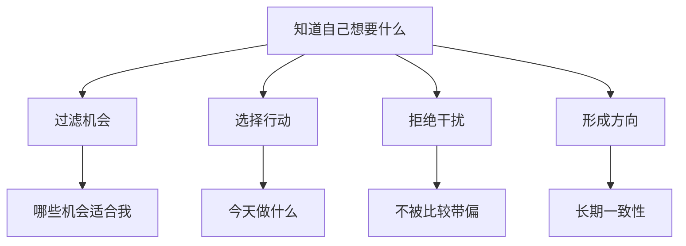

# You need to know what you want

## 一句话总结

如果不知道自己真正想要什么，就很容易被平台、他人目标和短期刺激牵着走。

## NotebookLM 式知识信息图

## 核心观点

1. 清晰目标是过滤器，没有目标时一切建议都显得有道理。
2. 想要什么不是空想，而是通过行动、反馈和复盘逐渐明确。
3. 对创作者来说，目标决定选题、产品、受众和生活方式。

## 可执行行动

- [ ] 写下 3 个当前最想要的结果。
- [ ] 为每个结果写出代价：需要放弃什么？
- [ ] 本周只选择一个结果作为行动中心。

