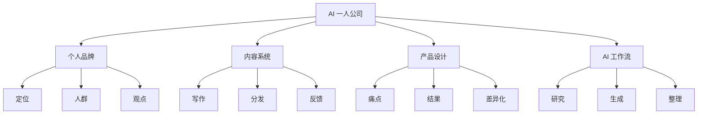

# How To Build A $1M One-Person Business Faster With AI

## 一句话总结

AI 可以加速一人公司，但前提是先明确个人品牌策略、内容系统、产品定位和差异化。

## NotebookLM 式知识信息图

## 核心观点

1. 一人公司不是简单“用 AI 赚钱”，而是用 AI 放大一个清晰的商业系统。
2. 个人品牌策略决定你吸引谁、解决什么问题、以什么角度表达。
3. 内容是信任入口，产品是结果交付，AI 是加速器。
4. 产品要卖具体转变，而不是泛泛的信息。

## 详细学习笔记

公开视频描述显示，这期包含一人公司基本逻辑、AI 工作流、个人品牌策略 prompt、写出更好内容、卖什么以及如何让产品突出。

对自己的知识库和账号来说，可直接转化成流程：先定义目标人群和核心问题，再用 AI 辅助研究受众语言、生成内容角度、整理产品结构。AI 不替代定位判断，但能加快从模糊想法到可测试内容的速度。

## 可执行行动

- [ ] 写出自己的目标人群：他们想得到什么、害怕什么、卡在哪里。
- [ ] 用 10 条内容测试一个产品主题。
- [ ] 为一个小产品写清楚“用户从 A 到 B 的转变”。

## 可拆分的原子笔记建议

- [[AI 一人公司]]
- [[个人品牌策略]]
- [[产品差异化]]

