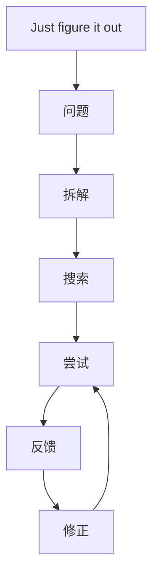

# I’m begging you to just figure it out

## 一句话总结

成长的关键能力之一，是停止等待完整教程，开始自己拆问题、找资源、试错和复盘。

## NotebookLM 式知识信息图

## 核心观点

1. 很多能力不是被教会的，而是在解决真实问题时长出来的。
2. 等待别人给完整路线，会降低自己的问题解决能力。
3. 一人公司尤其需要“自己搞定”的操作系统。

## 可执行行动

- [ ] 遇到新问题时，先写出 3 个可能解法再问人。
- [ ] 每次求助前，记录自己已经尝试过什么。
- [ ] 把解决过程沉淀成自己的 SOP。

