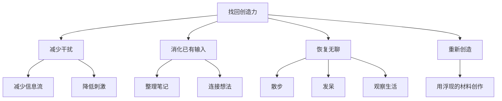

# If You Lost Your Creative Genius

## 一句话总结

创造力消失通常不是因为没有天赋，而是输入太多、处理太少、无聊太少、生活兴趣被噪音覆盖。

## NotebookLM 式知识信息图

## 核心观点

1. 没有想法，可能是因为干扰太多，而不是能力不够。
2. 被条件化的生活会削弱好奇心，生产力至上也可能压扁创造力。
3. 无聊不是敌人，它是新奇感和原创想法的入口。
4. 恢复创造力的顺序是减少输入、消化已有材料、重新对生活感兴趣、再创作。

## 详细学习笔记

视频章节给出 7 天路径：前两天减少输入，第 3-4 天消化已有内容，第 5-6 天重新对生活产生兴趣，第 7 天用浮现出的东西创作。

这非常适合放进个人内容系统：当感觉脑子被烧干时，不要继续加输入，而是停下来整理已有素材。很多创意不是来自更多信息，而是来自信息之间终于有时间连接。

## 可执行行动

- [ ] 做 48 小时信息减量：少刷推荐流，保留必要输入。
- [ ] 整理过去 30 天保存的素材，找出 5 个反复出现的主题。
- [ ] 每天安排 20 分钟无手机散步。

## 可拆分的原子笔记建议

- [[创造力恢复]]
- [[信息减量]]
- [[无聊的价值]]

