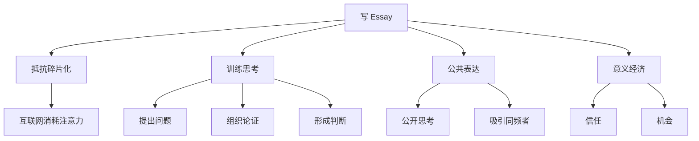

# Start Writing Essays Even If You Hate Writing

## 一句话总结

写 essay 的价值不是“成为作家”，而是恢复深度思考能力，并在意义经济中建立可信的个人表达。

## NotebookLM 式知识信息图

## 核心观点

1. 互联网没有死，但碎片化内容正在削弱人的深度思考。
2. Essay 是训练完整思维链条的工具：观察、提问、论证、表达。
3. 在意义经济中，能清楚表达复杂想法的人更容易建立信任。

## 详细学习笔记

视频章节提到“三种破坏文明思考能力的力量”和“essay 可能是最后的真实思考堡垒”。这说明 Dan Koe 把写作看作一种认知防御，而不仅是内容生产技巧。

对个人品牌来说，短内容可以带来曝光，但长文更能建立深度信任。一个人能不能讲清楚一个问题，决定了别人是否愿意把注意力、信任甚至金钱交给他。

## 可执行行动

- [ ] 每周写 1 篇 800-1500 字 essay。
- [ ] 每篇只解决一个问题：我为什么相信这个观点？
- [ ] 从 essay 中拆出 3 条短内容用于分发。

## 可拆分的原子笔记建议

- [[Essay 写作]]
- [[公共思考]]
- [[意义经济]]

