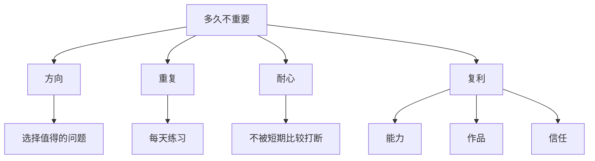

# It doesn't matter how long it takes

## 一句话总结

长期主义的重点不是速度，而是持续朝正确方向积累，直到能力、作品和机会发生质变。

## NotebookLM 式知识信息图

## 核心观点

1. 真正重要的目标往往无法用短周期衡量。
2. 焦虑来自把别人的时间线当成自己的验收标准。
3. 只要方向正确，时间会把小重复变成复利。

## 可执行行动

- [ ] 为一个长期目标写下 12 个月衡量标准，而不是 7 天结果。
- [ ] 每天只追踪“是否完成关键动作”。
- [ ] 每周复盘方向，而不是每天怀疑人生。

