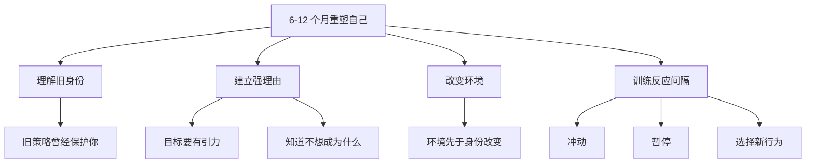

# How To Completely Reinvent Yourself In 6-12 Months

## 一句话总结

重塑自己不是靠短期冲动，而是靠强理由、反面身份、环境改变和“冲动到反应”的间隔训练。

## NotebookLM 式知识信息图

## 核心观点

1. 旧身份是一组生存策略，不会因为你想改变就自动消失。
2. 改变需要强到足以拉动你的理由，也需要清楚知道自己不想成为什么样的人。
3. 环境改变要快于身份回弹，否则旧环境会不断把你拉回旧模式。
4. 真正的自由来自拉开“冲动”和“反应”之间的距离。

## 详细学习笔记

视频章节强调“lock in, fall off, repeat”，这很像很多人的成长循环：突然自律、短暂爆发、掉回旧生活、再重新开始。问题不在意志力，而在身份、环境和反馈系统没有改变。

可操作的核心是先制造强引力：明确一个非做不可的理由。同时建立反面清单：哪些生活状态、关系、消费、工作方式是自己不愿再重复的。然后快速调整环境，让新身份更容易发生。

## 可执行行动

- [ ] 写一页“我不想成为的人”。
- [ ] 找出 3 个会把自己拉回旧模式的环境触发器。
- [ ] 每次冲动出现时，练习延迟 10 分钟再决定。

## 可拆分的原子笔记建议

- [[身份重塑]]
- [[环境设计]]
- [[冲动与反应间隔]]

