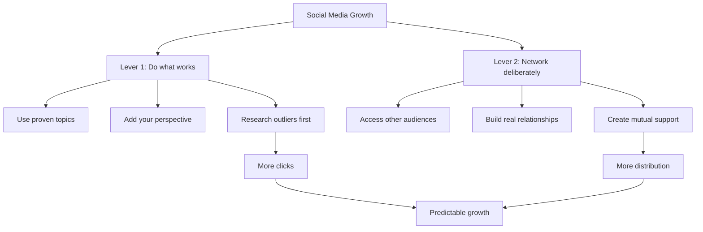

# Growing on social media is easy, actually

## One-Sentence Summary

Dan Koe argues that audience growth becomes much more predictable when creators stop treating social media like luck and focus on two controllable levers: proven topic packaging and deliberate relationship-building.

## Source Metadata

- Channel: Dan Koe
- Primary source: https://letters.thedankoe.com/p/growing-on-social-media-is-easy-actually
- Supporting source: https://letters.thedankoe.com/archive
- Channel page checked: https://www.youtube.com/@DanKoeTalks
- Published: 2026-05-07
- Studied: 2026-06-13
- Subtitle: There are 2 levers you can pull
- Confidence note: Medium confidence. The official long-form post provides strong first-party content for the same titled release, but the public YouTube watch URL, chapters, and transcript text were not recoverable from indexed sources during this run.

## Core Ideas

1. Growth is not random if you understand the mechanics of attention and repeatedly package ideas around topics people already want.
2. Originality on social media usually comes from perspective, not from inventing entirely new topics.
3. Reliance on the algorithm drops when you systematically build relationships with adjacent creators and their audiences.

## NotebookLM-Style Knowledge Infographic

## Detailed Learning Notes

### 1. The main claim: growth is a skill, not luck

Dan frames beginner frustration as a category error. People scroll social media every day, so they mistake posting for casual self-expression. His claim is that platforms have mechanics, incentives, and repeatable patterns just like any other industry. If you study those mechanics, growth becomes less mysterious.

The useful shift is from:

- "I hope this one goes viral"

to:

- "I understand which variables raise the chance that the right people see, click, and share this"

### 2. Lever one: do what works, from your own perspective

His first lever is not "be more original." It is almost the opposite: start with ideas that are already validated.

The logic is:

- people are usually looking for useful or interesting takes on topics they already care about
- strong titles, hooks, and angles tend to recur because they solve recurring problems
- creators can borrow the topic frame without copying the substance

This is a useful distinction between packaging and content. Packaging gets attention. Perspective gives the piece a reason to exist. Dan's point is that creators waste years trying to invent novelty at the topic level when they should be learning how to attach their own interpretation to subjects that are already proven to attract interest.

His examples imply a simple operating principle:

- find outlier titles, hooks, or themes
- ask what deeper problem they are actually solving
- rebuild the content from your own knowledge, experience, and worldview

### 3. Proven topics are not creative compromise

One of the strongest ideas in the piece is that repeated topics are normal because human problems repeat. A title about memory, discipline, getting ahead, or learning faster can be used by multiple creators because the audience demand is broad and persistent.

That matters because many creators confuse "I have seen this topic before" with "I should not talk about it." Dan's argument is that repetition is acceptable when the creator adds a distinct lens. The constraint is not avoiding overlap. The constraint is avoiding hollow imitation.

Practical implication:

- if a title pattern already works, that is evidence of demand
- your job is to make the inside of the content meaningfully yours

### 4. Research before writing

Dan treats content research as a formal stage rather than a side activity. He contrasts slow, ad hoc idea collection with a more deliberate system for studying outliers and saving strong examples.

The broader lesson is that content creation is not just drafting. It is:

1. observe what consistently performs
2. collect and organize examples
3. identify why they work
4. apply them to your own niche, transformation, or worldview
5. only then write

This matches a larger creator principle: good output is often downstream of a better idea inventory. Writers who feel blocked often do not have a writing problem; they have a research and idea-selection problem.

### 5. Lever two: networking is distribution control

Dan's second lever is interpersonal rather than algorithmic. If followers come from people seeing your work, then the fastest non-paid way to create more visibility is to get your work in front of other people's audiences.

That sounds obvious, but his framing sharpens it:

- the source of attention is other audiences
- access to those audiences comes from relationships
- relationships come from repeated, sincere, low-need interaction

So the tactic is not "ask for shoutouts." The tactic is to become part of a network of creators who know your name, respect your work, and are willing to share it because the relationship is real and reciprocal.

### 6. Non-needy networking

The useful nuance is the "non-needy" part. Dan emphasizes simple praise, curiosity, and normal conversation. The hidden principle is that networking works when it feels like friendship and professional alignment, not extraction.

His implied sequence is:

1. reach out to people you actually respect
2. start with a small, genuine response to something they made
3. show interest in what they are building
4. continue the conversation without forcing an ask
5. over time, create mutual familiarity and trust

This reduces the emotional resistance many beginners have to networking. They imagine manipulative outreach. Dan reframes it as becoming socially present in the circles you want to grow within.

### 7. My interpretation

The two-lever model is really a simple strategic formula:

- better packaging gives you more initial attention
- better relationships give you more repeat distribution

Together, those reduce dependence on luck. The deeper takeaway is that growth is an operational system, not a motivational problem. If growth is stalled, the most likely bottlenecks are weak market research, weak packaging, weak distribution relationships, or all three.

## Practical Actions

- [ ] Build a swipe file of 25-50 proven titles, hooks, and formats in your niche, then annotate why each one likely works.
- [ ] For your next 10 posts or videos, start from validated topic demand and force yourself to add a specific personal angle or lived example.
- [ ] Spend 30 minutes a day on intentional relationship-building with creators near your current level instead of only publishing and waiting.

## Atomic Note Suggestions

- [[Packaging versus perspective in content creation]]
- [[Validated demand before creative expression]]
- [[Non-needy networking]]
- [[Audience growth as a system]]
- [[Swipe file for high-performing hooks]]

## Connections To My System

- Content creation: This note sharpens the split between idea validation, packaging, and original substance.
- One-person business: Distribution is not separate from the business; content growth is an acquisition system.
- Learning system: Researching outliers is a form of deliberate study, not just inspiration hunting.
- Obsidian knowledge base: A dedicated swipe file and creator-relationship notes could make future content production more systematic.

## Reflection Questions

- Am I avoiding proven topics because I confuse repetition with lack of originality?
- Which of the two levers is currently weaker in my system: packaging or relationships?
- If I reviewed my last 20 posts, how many were based on researched demand versus whatever I felt like posting that day?
