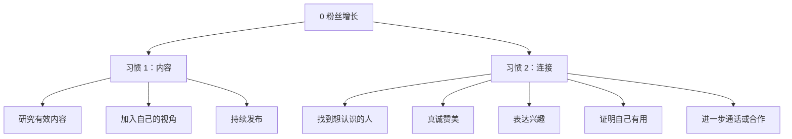

# How To Grow An Audience If You Have 0 Followers

## 一句话总结

从 0 粉丝开始增长，核心是两个习惯：用自己的视角持续做有效内容，并主动建立高质量连接。

## 来源信息

- 链接：https://www.youtube.com/watch?v=7HM-rptYdTs
- 章节依据：公开视频描述中的章节
- 关键章节：做有效内容、从自身视角表达、networking、发私信、提供价值、建立深连接

## NotebookLM 式知识信息图

## 核心观点

1. 增长不是玄学，先做已经被市场证明有效的内容结构。
2. 有效不等于复制，必须加入自己的生活经验、问题意识和审美。
3. Networking 不是功利社交，而是通过真诚兴趣和实用价值建立连接。

## 详细学习笔记

这个视频的章节给出一条清晰路径：先“做有效内容”，再“从自己的视角做”，然后通过主动连接让内容和机会产生复利。

对 0 粉丝的人来说，最容易犯的错是只等平台推荐。更现实的做法是：每天拆解内容，每天发布小作品，每天真诚联系一个相关领域的人。内容带来展示面，关系带来反馈和机会。

私信的顺序也很关键：先找真正想认识的人，再发具体赞美，然后表达兴趣，接着展示自己有用，最后才提出进一步交流。这个顺序可以降低冒犯感。

## 可执行行动

- [ ] 每天拆解 3 个同领域高质量标题。
- [ ] 每天发布 1 条带个人视角的短内容。
- [ ] 每天给 1 个同领域创作者发具体、真诚、有信息量的私信。

## 可拆分的原子笔记建议

- [[0 粉丝增长]]
- [[内容拆解]]
- [[创作者 Networking]]

