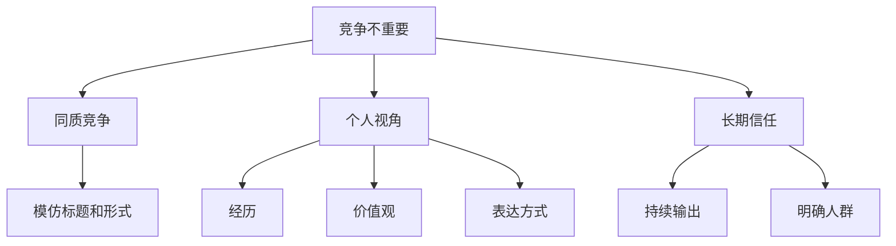

# Competition is irrelevant

## 一句话总结

真正的差异化不是打败竞争者，而是形成别人无法复制的视角、经历和表达方式。

## NotebookLM 式知识信息图

## 核心观点

1. 如果你只复制别人的选题和形式，竞争会显得非常拥挤。
2. 如果你把个人经验、价值判断和独特问题意识加入内容，竞争会变弱。
3. 对一人公司来说，最强护城河是“我为什么这样看世界”。

## 可执行行动

- [ ] 写下 10 个自己和同行看法不同的主题。
- [ ] 每篇内容都加入一个个人经历或独特判断。
- [ ] 少问“别人做什么”，多问“我能怎么解释这个问题”。

