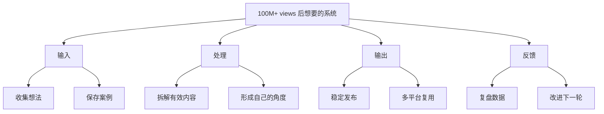

# After 100M+ views, this is the system I wish I had when I started

## 一句话总结

内容增长需要一个可重复的创作系统，而不是每次靠灵感、意志力或临时爆发。

## 来源信息

- 频道：Dan Koe
- 链接：https://www.youtube.com/watch?v=CshMqdaUGcQ
- 发布时间：2026-05-22
- 学习日期：2026-05-31
- 字幕依据：公开标题与简介；字幕不可用

## NotebookLM 式知识信息图

## 核心观点

1. 创作者早期最缺的不是努力，而是保存、拆解和复用想法的系统。
2. 爆款不是完全随机，背后通常有主题、结构、角度和分发的重复模式。
3. 工具的价值在于降低创作摩擦，让好想法更快进入生产流程。

## 详细学习笔记

这个视频的标题暗示了一个重要经验：大量曝光之后回看，最想补上的往往不是某个技巧，而是一整套内容生产系统。对创作者来说，最容易浪费的是灵感散落、案例丢失、复盘缺位。

可迁移到自己的工作流：把看到的好标题、好开头、好论点、好结构放进一个素材池，再定期拆解。每个素材都问三个问题：为什么它吸引人？它解决了什么冲突？我能用自己的经历和观点重写它吗？

## 可执行行动

- [ ] 建立一个“内容 swipe file”，保存标题、开头、论点和结构。
- [ ] 每天拆解 1 条高表现内容，写出可复用模板。
- [ ] 每周复盘自己发布内容的数据，把反馈写回素材库。

## 可拆分的原子笔记建议

- [[内容创作系统]]
- [[Swipe File]]
- [[创作复盘]]

