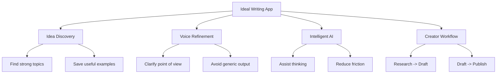

# I built the writing app I've always wanted

## One-Sentence Summary

Dan Koe frames Eden as a writing system that compresses the full creator workflow into one place: find strong ideas, clarify your voice, and use AI as an amplifier rather than a replacement.

## Source Metadata

- Channel: Dan Koe
- Primary source: https://letters.thedankoe.com/p/i-built-the-writing-app-ive-always
- Supporting source: https://letters.thedankoe.com/archive
- Product referenced: https://eden.so
- Published: 2026-05-23
- Studied: 2026-06-09
- Duration: 14:54
- Confidence note: Low confidence. The official post clearly indicates this is a video and exposes the title, subtitle, duration, and product link, but the transcript body was not accessible through public indexed sources during this run.

## Core Ideas

1. A useful writing tool should start before drafting by helping creators discover and collect better ideas.
2. Voice matters more than raw output speed, so AI should help refine a creator's perspective instead of flattening it.
3. The real bottleneck for creators is workflow fragmentation between research, idea capture, drafting, and iteration.

## NotebookLM-Style Knowledge Infographic

## Detailed Learning Notes

### 1. What problem this video appears to solve

Based on the official title and subtitle, the central problem is not "how do I write faster?" but "how do I make the whole writing process coherent?" Most creator tools solve one slice of the process: note capture, drafting, grammar, or AI chat. Dan Koe's framing suggests he wants a single environment that helps creators move from idea discovery to finished expression.

### 2. What "the writing app I always wanted" implies

The wording implies dissatisfaction with generic note-taking or generic AI tools. A creator usually needs at least four things:

- a place to collect high-signal source material
- a way to spot patterns in what already works
- a way to preserve personal voice and not collapse into average AI output
- a way to turn raw ideas into publishable drafts with less friction

The subtitle makes those priorities explicit: discover ideas, refine voice, and use AI intelligently.

### 3. AI as augmentation, not substitution

The phrase "use AI intelligently" is the most important signal in the available metadata. It implies a distinction between:

- lazy AI use: asking for instant content and accepting bland output
- strategic AI use: using models to organize research, surface patterns, challenge framing, and accelerate draft development

This is consistent with Dan Koe's broader public positioning: the creator's leverage comes from taste, synthesis, and perspective, while tools should compress the mechanical parts of the workflow.

### 4. Why voice is treated as a product feature

Most writing software optimizes for storage or formatting. This video's framing suggests that voice itself is a design target. That matters because creators do not win by publishing interchangeable information. They win by making familiar topics feel sharper, clearer, more usable, or more distinct. A system that helps a creator identify and reinforce their own intellectual signature can create better long-term differentiation than a system that only speeds up word generation.

### 5. My interpretation

This looks less like a pure app demo and more like a philosophy-of-tools video. The underlying claim seems to be:

> Better creative output comes from better systems for noticing, filtering, shaping, and expressing ideas.

Because transcript text was unavailable, treat this note as a structured interpretation of the public metadata rather than a line-by-line extraction.

## Practical Actions

- [ ] Audit your writing workflow and list where ideas currently get lost between capture, research, drafting, and publishing.
- [ ] Build a small swipe file for titles, hooks, structures, and arguments that match your niche.
- [ ] Define 3-5 traits of your own writing voice so any AI assistance can be evaluated against them.

## Atomic Note Suggestions

- [[Idea discovery workflow]]
- [[Writing voice as a competitive advantage]]
- [[AI as writing amplifier]]
- [[Creator workflow fragmentation]]
- [[Swipe file for creators]]

## Connections To My System

- Content creation: This note is directly relevant to building a repeatable research-to-draft workflow.
- One-person business: Better writing systems compound audience growth and product distribution.
- Learning system: Idea capture only matters if it feeds synthesis and publishing.
- Obsidian knowledge base: The vault can serve as the long-term memory layer behind a stronger content workflow.

## Reflection Questions

- Which part of my current writing process creates the most friction: finding ideas, shaping arguments, or finishing drafts?
- If AI removed mechanical effort, what part of my voice or taste would still make the work uniquely mine?
- What would a "writing app I actually want" need to do that my current tools still do poorly?
