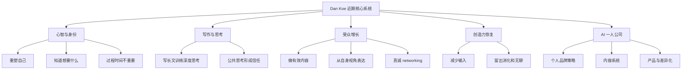

# Dan Koe 10 个视频学习地图

## 一句话总结

这 10 个视频共同指向一个系统：用写作澄清思考，用内容建立个人品牌，用网络连接放大机会，用 AI 和工具加速一人公司的产品化。

## NotebookLM 式总信息图

![[assets/dankoe-10-videos-learning-map.svg]]

## 旧版 Mermaid 草图

## 今日入库视频

1. [[2026-05-22 - After 100M views this is the system I wish I had]]
2. [[2026-05-19 - Competition is irrelevant]]
3. [[2026-05-14 - How To Grow An Audience If You Have 0 Followers]]
4. [[2026-05-02 - How To Completely Reinvent Yourself In 6-12 Months]]
5. [[2026-04-11 - It does not matter how long it takes]]
6. [[2026-04-05 - Start Writing Essays Even If You Hate Writing]]
7. [[2026-03-28 - If You Lost Your Creative Genius]]
8. [[2026-03-25 - Just Figure It Out]]
9. [[2026-03-15 - Build A One-Person Business Faster With AI]]
10. [[2026-03-12 - You Need To Know What You Want]]

## 对我的启发

- 内容不是单篇爆款，而是一个从观察、思考、写作、发布、反馈到产品化的循环。
- 一人公司要先建立“看问题的方式”，再把方法压缩成内容、服务或产品。
- 每天学习视频时，最有价值的不是复述，而是提炼一个可以马上应用到账号、产品或生活系统的动作。
