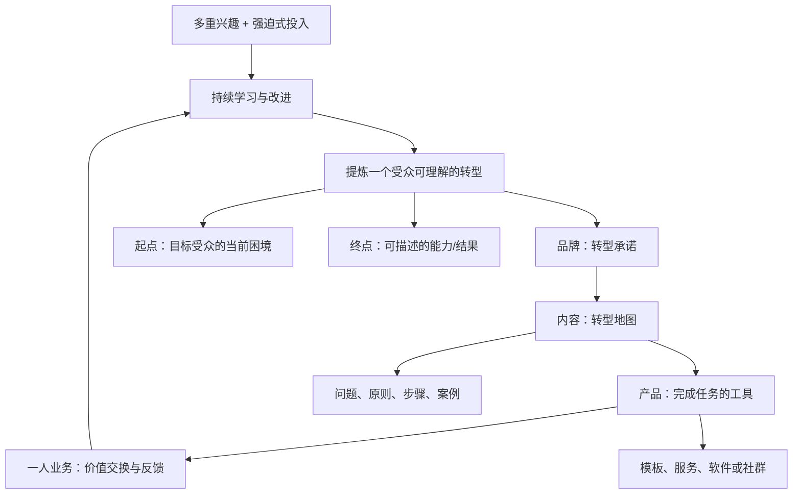

# If You Have Multiple Interests, Start A One-Person Business

## 一句话总结

把“兴趣很多”从分散的自我标签，转为一条可被看见、跟随并购买的个人转型路径：品牌说明变化，内容绘制路线，产品提供工具。

## 来源信息

- 频道：Dan Koe
- 链接：https://www.youtube.com/watch?v=FBHhmqBs894
- 发布：2026-06-13 14:37 UTC（YouTube RSS）
- 学习日期：2026-06-21
- 字幕依据：未能恢复可用的公开视频字幕；以下笔记以官方 RSS 描述和章节为依据，置信度低。
- 章节：`0:00 I am obsessive`、`3:22 Why learners and improvers have more leverage than ever before`、`11:26 How to turn your love for learning into a business`、`17:08 Your brand is the transformation`、`20:42 Your content is the map`、`25:06 Your product is the tool`。

## 核心观点

1. 视频把“学习者和持续改进者的杠杆”与一人业务相连：兴趣不必先压缩成单一身份，但需要被组织成可持续的价值主张。
2. 品牌不是兴趣清单，而是你帮助某类人完成的转型；这是章节 “Your brand is the transformation” 的直接框架。
3. 内容是让受众理解并走向该转型的地图，产品则是把地图转化为可执行结果的工具。

## NotebookLM 式知识信息图

## 详细学习笔记

### 1. 问题背景：多重兴趣为何会卡住

从章节标题看，视频以“obsessive（痴迷式投入）”开场，并把重点放在学习者和改进者的新杠杆。可作出的稳妥解读是：问题不在于兴趣数量，而在于外界无法判断这些兴趣最终为谁解决什么问题。若每次输出都换一个没有关联的话题，兴趣会表现为噪声；若它们共同解释一个转型过程，兴趣会成为差异化素材。

### 2. 关键机制：把兴趣组织为转型

“Your brand is the transformation” 给出本视频最清晰的机制。先写出受众的起点、希望抵达的终点，以及你自己的经历、学习与方法如何连接两者。品牌的单位不是“我懂什么”，而是“我帮助谁从哪里到哪里”。这也允许多重兴趣共存：只要每一项能解释、支持或加速同一个转型，它就属于同一业务叙事。

### 3. 方法步骤：品牌、内容、产品三层对齐

官方章节依次给出品牌、内容、产品三个层次，可整理为一条工作流：

1. 选择一个当前愿意长期研究的问题，而不是试图永久选择唯一兴趣。
2. 定义目标受众的可观察起点与可观察终点，形成转型表述。
3. 用内容把路线拆成问题、原则、实验、失败与步骤；内容的职责是降低理解门槛，而非只展示博学。
4. 当反复出现的阻碍足够具体时，设计产品作为工具：模板、诊断、服务、课程、软件或工作流均可，但必须服务于地图上的一个明确节点。
5. 用受众反馈修正地图与工具，再决定哪些兴趣值得继续投入。

### 4. 边界与验证

本笔记没有逐字稿，不能把上述框架误写为视频中的逐句主张。尤其“产品的具体形态”和“如何定价”并未在公开章节中给出。实际使用前，应观看原视频或取得字幕，验证品牌/内容/产品之间是否还有作者提出的顺序、案例或限制条件。

### 5. 我的理解

一人业务不要求先完成自我定义，再开始行动。更实用的顺序是先围绕一个转型公开学习与构建；内容留下思考轨迹，产品把重复性需求工具化。多重兴趣的价值在于提供跨领域的解释力，但需要一个受众能复述的“共同目的地”。

## 可执行行动

- [ ] 写一句转型陈述：我帮助 `谁` 从 `当前困境` 到 `目标状态`，主要通过 `我的兴趣组合/方法`。
- [ ] 选一个转型节点，列出 10 个内容题目：3 个问题、3 个原则、2 个实验、2 个案例。
- [ ] 找出受众完成该节点时最重复的一个摩擦点，先做一个最小工具（清单、模板或诊断），并收集 5 条反馈。

## 可拆分的原子笔记建议

- [[品牌是转型承诺]]
- [[内容是转型地图]]
- [[产品是完成转型的工具]]
- [[多重兴趣的叙事整合]]

## 与我的系统连接

- 内容创作：围绕一个转型建立选题地图，避免只按兴趣随机发布。
- 一人公司：先验证一个重复摩擦点，再选择产品形式，减少“先造产品后找问题”。
- 学习系统：把学习记录转化为可公开的原则、实验和案例。
- Obsidian 知识库：用“转型—地图—工具”链接项目笔记、内容笔记与产品笔记。

## 待复盘问题

- 我最常研究的三个兴趣，能否共同服务于同一个受众转型？
- 哪个内容主题最能证明我正在走这条路线，而不是只罗列知识？
- 我的第一个工具解决的是地图上的哪一步？
