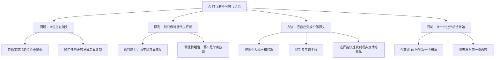

---
title: "How To Become So Valuable AI Can Never Replace You"
created: 2026-07-05
updated: 2026-07-05
type: summary
tags: [dan-koe, video, learning, productivity, content, ai, skill-acquisition]
sources:
  - "https://www.youtube.com/watch?v=K2QvCV1PB1w"
  - "https://www.youtube.com/feeds/videos.xml?channel_id=UCWXYDYv5STLk-zoxMP2I1Lw"
confidence: low
contested: false
contradictions: []
channel: "Dan Koe"
video_id: "K2QvCV1PB1w"
duration: "unknown"
transcript_basis: "未获取到字幕；依据 YouTube 官方 RSS 里的标题、简介、章节和公开视频元数据整理"
---

# How To Become So Valuable AI Can Never Replace You

## 一句话总结

Dan Koe 认为，想在 AI（人工智能，可以理解成会帮人处理文字、图片、代码等任务的工具）时代不被替代，关键不是守住某个固定岗位，而是把真实反馈、个人经验、独特观点和可公开验证的技能组合成别人难复制的价值。

## 来源信息

- 频道：Dan Koe
- 链接：https://www.youtube.com/watch?v=K2QvCV1PB1w
- 发布时间：2026-06-28T22:37:06+00:00
- 学习日期：2026-07-05
- 视频 ID：K2QvCV1PB1w
- 字幕依据：未获取到字幕；依据 YouTube 官方 RSS 里的标题、简介、章节和公开视频元数据整理
- 置信度：低。原因是没有拿到逐字字幕，以下内容是根据标题、简介和章节结构推断出来的学习笔记，不应当当作逐字转写。

## 核心观点

1. 不要把自己训练成只会执行岗位说明书的人，而要训练成能发现问题、形成判断、创造结果的人。
2. 未来更有价值的能力，来自“真实世界反馈 + 独特观点 + 可表达的个人经验”的组合，而不是只会套用通用知识。
3. 要从小行动开始改变轨迹：挖掘自己的原材料，找到反常识主线，并把第一个想法公开发布出去。

## 视觉知识信息图

> 推荐生成一张 `assets/2026-06-28-ai-can-never-replace-you.svg`，采用手绘视觉笔记风格：中心是一条从“岗位依赖”走向“不可替代价值”的路径，旁边放四个路标：真实反馈、个人原料、反常识主线、公开表达。

```markdown
![[assets/2026-06-28-ai-can-never-replace-you.svg]]
```

## Mermaid 草图



## 详细学习笔记

### 1. 问题背景

视频标题直接指向一个焦虑：AI（人工智能工具）会替代越来越多标准化工作。章节里从 “Jobs are disappearing”（工作正在消失）开始，说明 Dan Koe 不是在讨论某个软件技巧，而是在讨论普通人如何重新定位自己的生存方式。

这里的关键不是“所有工作都会消失”，而是“只按别人给的步骤做事”的人会越来越难证明自己的价值。因为一旦一件事能被清楚写成步骤，它就更容易被工具、模板或更便宜的人替代。

### 2. 关键机制

Dan Koe 的章节把问题推进到 “How to escape wage slavery”（如何摆脱工资依赖）。这不是说工资本身一定不好，而是提醒：如果一个人的收入完全依赖单一雇主、单一岗位和单一技能，那么外部环境一变，他就很被动。

更稳的方向，是把自己训练成能创造价值的人。这里的“价值”可以理解成：你能帮别人解决真实问题，而且别人愿意为结果付出注意力、信任或金钱。

章节里的 “The five ingredients of success”（成功的五个要素）没有完整字幕可核对，因此不能硬编具体五项。但从后续章节看，这五项大概率围绕这些方向展开：成长环境、真实反馈、技能选择、表达能力、个人原材料。

### 3. 方法步骤

第一步是进入会逼你成长的环境。章节 “Hurl yourself into an environment that forces growth” 的意思是，把自己放进一个必须输出、必须面对反馈的地方。比如公开写作、做视频、接真实客户、做小产品，而不是只在私下学习。

第二步是选择反馈离现实很近的载体。章节 “Choose a vessel where feedback is as close to reality as possible” 可以理解成：不要只做看起来努力、但没人检验的事情。公开内容有没有人看，产品有没有人用，服务有没有人买，都是现实反馈。

第三步是学习未来更抗替代的技能。章节 “Learn 1 of these 2 skills if you want to thrive in the future” 没有字幕确认是哪两个技能，但结合 Dan Koe 长期主题，较可能指向写作、表达、销售、软件/AI 辅助创造这类能放大个人判断力的技能。这里需要二次验证，不能当成原话。

第四步是从 15 分钟开始。章节 “How to start - set aside 15 minutes to change your trajectory” 很实用：不要把改变人生想成巨大工程，先每天拿出 15 分钟，做一件会改变轨迹的小事。

### 4. 例子与比喻

可以把一个普通岗位想成“租来的摊位”：摊位还在时，你能卖东西；摊位被收回时，你就很被动。不可替代价值更像“自己的手艺和招牌”：你可以换地方，但别人认识的是你的判断、表达和解决问题的能力。

“AI 替代人”也不是一个突然发生的开关，更像水位慢慢上涨。低处、标准化、重复性强的事情先被淹到；高处、需要判断、品味、信任和真实经验的事情更晚受到冲击。

### 5. 我的理解

这支视频最有价值的地方，是把“不要被 AI 替代”从恐惧问题改成训练问题。与其问“哪个岗位最安全”，不如问“我怎样变成一个能不断发现问题、表达观点、创造结果的人”。

对一人公司来说，这个思路很直接：品牌不是包装，而是别人对你判断力的长期记忆；内容不是发帖任务，而是公开训练判断力；产品不是凭空设计，而是从真实反馈里长出来的解决方案。

## 可执行行动

- [ ] 今天花 15 分钟写下 10 条“我最近反复思考的问题”，不要追求漂亮，只要真实。
- [ ] 从 10 条里挑 1 条，写成一段 100-200 字的公开观点，重点是“我为什么这样看”。
- [ ] 给这个观点加一个反常识角度，例如“大家都以为 X，其实真正的问题是 Y”。
- [ ] 选择一个能收到反馈的地方发布，比如朋友圈、视频号、小红书、公众号或 X（原 Twitter，一个公开发短内容的平台）。
- [ ] 记录反馈：有人点赞、评论、私聊、反驳，分别说明什么。

## 可拆分的原子笔记建议

- [[不可替代价值不是岗位安全，而是持续创造结果的能力]]
- [[真实反馈比自我感觉更能训练判断力]]
- [[个人品牌是别人对你判断力的长期记忆]]
- [[反常识主线能让普通经验变成独特内容]]
- [[每天 15 分钟的公开输出可以改变职业轨迹]]

## 与我的系统连接

- 内容创作：把“公开发布想法”当成训练判断力，而不是单纯追流量。
- 一人公司：从个人经验、兴趣和现实反馈里提炼产品方向。
- 学习系统：学习不只输入资料，还要通过输出接受现实检验。
- Obsidian 知识库：把视频拆成原子笔记，再连接到 AI、个人品牌、一人公司和内容系统。

## 待复盘问题

- 这个视频中最值得实践的一件事是什么？
- 我现在最容易被替代的工作方式是什么？
- 我有哪些个人经验，是 AI 不能凭空拥有的“原材料”？
- 我能不能在明天发布一个带有反常识主线的想法？
- 哪个观点需要二次验证？尤其是“未来应学习的两个技能”，需要等字幕或完整视频确认。
