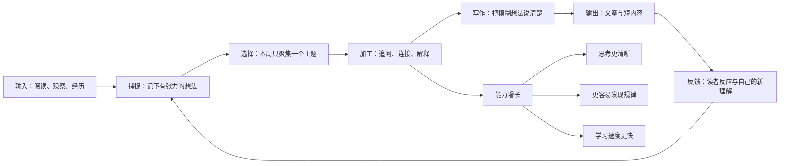
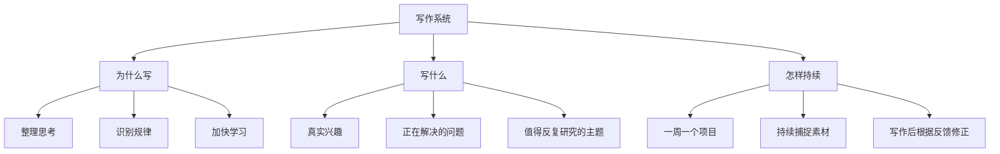

# The Writing System That Saved My Brain（拯救我大脑的写作系统）

## 一句话总结

写作不只是输出内容，而是一套把零散输入变成清晰思考、可复用知识和一周创作成果的处理系统。

## 来源信息

- 频道：Dan Koe
- 链接：https://www.youtube.com/watch?v=KCjwU4XYBL8
- 视频 ID：KCjwU4XYBL8
- 发布时间：2026-07-27 22:42:33 UTC（世界协调时间）
- 学习日期：2026-08-06
- 时长：至少 26:07（章节最后时间点；未能取得完整时长）
- 字幕依据：未取得逐字字幕。YouTube 字幕清单返回空内容，视频页面随后因网络请求限制而无法读取；以下内容主要依据官方 RSS 中的视频说明和章节，以及视频说明所链接的 Eden 公开页面标题。
- 可信度说明：低。核心结构可由章节直接确认，但章节内的细节、例子和原话无法逐句核对。

## 核心观点

1. 写作会迫使模糊想法变得具体，因此能训练思考、表达和识别事物之间联系的能力。
2. 在新的网络环境里，个人可以用写作积累知识、建立信任并放大成果；关键不是一次写出完美文章，而是建立稳定的处理流程。
3. 一周围绕一个主题推进一个创作项目，可以把学习、记录、思考与发布串成同一条路径，减少每天重新选题的消耗。

## 视觉知识信息图

## Mermaid 草图

## 详细学习笔记

### 1. 问题背景

视频从“学习写作”切入，并把它放到新旧两种个人发展方式的变化里讨论。旧方式更依赖职位、机构和已有资源；新方式允许个人借助互联网，把知识和观点复制给更多人。这里的重点不是把写作只当成职业技能，而是把它当作个人处理信息与创造成果的基础能力。

现代人的问题往往不是没有信息，而是输入太多、处理太少。只收藏、不整理，会让资料停留在外部；写作则要求人决定什么重要、各部分如何连接、怎样让别人理解。这个过程本身就是学习。

### 2. 关键机制

根据章节，视频把写作的作用拆成四个相互连接的变化：

- 写作重新训练思考：必须把“我大概懂”变成可以说清楚的句子，模糊处会自然暴露。
- 写作提高规律识别：当不同来源的想法被放到同一篇文章里，更容易发现重复结构和新的连接。
- 写作改善表达：不断寻找准确词语和清楚顺序，会让口头与书面沟通一起变好。
- 写作加快学习：把学到的内容重新组织并解释，相当于进行一次主动处理，而不是被动浏览。

需要注意：以上方向与官方章节一致，但由于没有逐字字幕，无法确认 Dan Koe 对每个机制给出的完整论证和例子。

### 3. 方法步骤

可以把公开章节还原为一套最小可行流程：

1. 捕捉：看到有价值的观点、问题或例子时立即记下，不依赖临时记忆。
2. 选题：从近期反复出现、自己真正想弄懂的问题中选一个，而不是追逐所有热门话题。
3. 聚焦：把这个主题设为一周唯一的主要创作项目，让阅读和观察都为它服务。
4. 加工：把材料分成问题、原因、方法、例子与行动，找出还说不清楚的地方。
5. 输出：先形成一篇完整文章，再从中拆出较短内容；让一次深入思考产生多种成果。
6. 反馈：观察哪些部分最难写、哪些表达最能引发回应，作为下一轮学习的起点。

### 4. 例子与比喻

可以把大脑想成厨房：收藏的信息只是买回来的食材，笔记是清洗和分类，写作才是真正烹饪。食材再多，如果从不下锅，也不会变成能被自己或别人吸收的一餐。

“一周一个项目”则像给散落的水流挖一条河道。同一周看到的文章、对话和问题都会流向一个主题，积累更容易形成成果，而不是变成互不相干的收藏。

这些比喻是本笔记为了帮助理解所作的归纳，不是已核对的视频原话。

### 5. 我的理解

这套系统真正有价值的地方，是把学习和创作从两件事变成一件事：不是先无限学习、等准备好再输出，而是通过输出发现自己还缺什么，再回去补充。写作因此成为学习的检查工具。

对 Obsidian（一个把笔记连成知识网络的工具）来说，文章不应只是资料终点。每次写完后，可以把最小、最能重复使用的观点拆成独立笔记，再让这些笔记服务下一篇文章。这样，知识库会从“收藏夹”逐步变成“思考工作台”。

## 可执行行动

- [ ] 今天建立一个“本周写作项目”笔记，只写一个要解决的问题和期望读者得到的改变。
- [ ] 接下来 7 天，每天为这个主题捕捉 3 条素材，并分别标注为“观点、例子或问题”。
- [ ] 本周末写出一篇 800—1500 字文章，再从中拆出 3 条可以单独发布的短内容。
- [ ] 发布后记录一个读者反馈和一个自己仍说不清楚的地方，作为下一周的研究入口。

## 可拆分的原子笔记建议

- [[写作是思考的外部检查工具]]
- [[主动解释比被动收藏更能促进学习]]
- [[一周一个创作项目降低选题消耗]]
- [[写作通过连接信息提高规律识别能力]]
- [[先写完整文章再拆短内容]]

## 与我的系统连接

- 内容创作：用“一篇长文 → 多条短内容”的方式提高每次深入思考的复用率。
- 一人公司：持续公开解释自己解决的问题，能够积累信任，并逐渐显示自己可以提供的价值。
- 学习系统：把“能否用自己的话写清楚”作为是否真正学会的检验标准。
- Obsidian 知识库：以每周项目笔记汇集素材，完成后再拆出可重复连接的独立观点。

## 待复盘问题

- 我当前收藏最多、但从未写成文章的主题是什么？
- 如果本周只能完成一个创作项目，哪个问题最值得被说清楚？
- 我的写作流程在哪一步最容易停住：捕捉、选择、加工还是发布？
- 哪些关于“写作能改变大脑”的说法需要寻找认知科学研究进行二次验证？
