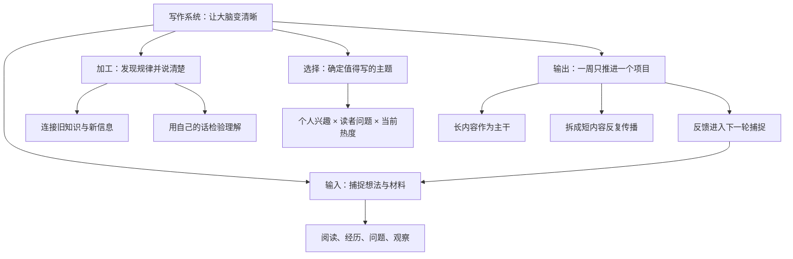

# The Writing System That Saved My Brain (Learn Faster & Think Clearly)

## 一句话总结

把写作当成一套“捕捉想法—选择主题—整合规律—围绕一个项目持续输出”的思考系统，可以同时提升学习速度、表达清晰度和内容创造能力。

## 来源信息

- 频道：Dan Koe
- 链接：https://www.youtube.com/watch?v=KCjwU4XYBL8
- 视频 ID：KCjwU4XYBL8
- 发布时间：2026-07-27 22:42:33 UTC（北京时间 2026-07-28 06:42:33）
- 学习日期：2026-08-06
- 字幕依据：公开字幕接口未返回内容；作者提供的 Eden 阅读页没有暴露可直接读取的逐字稿。本笔记主要依据官方标题、视频说明和章节，涉及论证细节的内容均应视为整理者理解，而非逐字转述。

## 核心观点

1. 写作不只是发布内容的手艺，也是整理思维、识别规律和加速学习的工具。
2. 新时代的杠杆来自可复制的思想与内容；清晰表达能让一个人的经验跨越时间和人数传播。
3. 稳定输出不应依赖临时灵感，而应建立从捕捉、筛选到周项目交付的固定流程。

## 视觉知识信息图

## 详细学习笔记

### 1. 问题背景

官方章节从“学习写作”开始，随后比较旧杠杆与新杠杆。这里可以理解为：过去扩大成果常依靠资本、人手或组织；互联网时代，文字、视频和软件可以几乎零成本地复制。一个人若能把思想写清楚，就能让同一份思考反复被看见。

但多数人的问题不是完全没有想法，而是想法散落在阅读、聊天和日常经历里，没有被保存和加工。临到发布时才寻找灵感，容易得到零散、模仿味重的内容。

### 2. 关键机制

根据 9:50 至 15:20 的官方章节，写作至少承担四种训练：改变思考方式、增强规律识别、帮助准确表达、加快学习。

- **外化思考**：脑中的感觉通常模糊，写下来后，缺口和矛盾才会显现。
- **规律识别**：长期记录不同材料，会更容易发现它们重复出现的结构。
- **准确表达**：寻找合适词句的过程，会迫使自己分辨“好像懂了”和“真的能说明白”。
- **主动学习**：为了写给别人看，需要重新组织材料，而不只是被动浏览。

以上是依据章节标题展开的机制解释，没有逐字稿支持，之后应在能取得字幕时复核 Dan Koe 的具体论证和例子。

### 3. 方法步骤

从 18:05、20:28 和 26:07 三个章节，可以整理出一个最小可行流程：

1. **持续捕捉**：保存让自己停下来思考的句子、问题、经历和观察，并补一句“它为什么重要”。
2. **选择主题**：从真正关心、亲身经历、读者正在面对的问题中找交集，而不是只追逐热度。
3. **形成角度**：把新材料与自己的旧经验连接，写出不同点、因果关系或可执行步骤。
4. **设定周项目**：一周围绕一个核心主题完成一份主内容，减少频繁换题造成的注意力损耗。
5. **拆分与反馈**：把主内容拆成短内容，观察哪些表达真正引起回应，再把反馈放回想法库。

### 4. 例子与比喻

可以把这套系统理解成厨房：捕捉箱是冰箱，主题选择是决定今天做什么菜，写作是清洗、切配和烹饪，周项目是端上桌的一道完整菜。只囤食材而不做菜，不等于真正学会；只在开饭前临时买菜，也很难稳定产出。

### 5. 我的理解

这套方法最有价值的地方，不是要求“每天发布”，而是把学习和创造合成同一个循环：输入时已经为输出做准备，输出又反过来暴露理解不足。真正的系统不是笔记软件或模板，而是每条材料最终都有机会进入一个明确的作品。

需要警惕的是，官方说明中包含 Eden 写作工具和训练营链接，因此视频也可能带有产品推广目的。方法是否有效，应以自己的连续实践结果验证，而不是只凭视频主张判断。

## 可执行行动

- [ ] 今天建立一个“想法收件箱”，收集 10 条近期反复想到的问题，每条补写一句“为什么值得写”。
- [ ] 从中选择一个同时满足“我有经验、别人有问题、我愿意研究”的主题，写出一句中心主张。
- [ ] 本周只围绕这个主题完成一篇 800～1500 字文章，并拆出 3 条短内容。
- [ ] 发布或分享后记录真实反馈：哪一句被引用、哪一点没人理解、下一版要补什么。
- [ ] 将本笔记与可获得的完整字幕再次核对，重点复核 2:26、18:05 和 20:28 三段。

## 可拆分的原子笔记建议

- [[写作是思考的外接屏幕]]
- [[用输出检验自己是否真正理解]]
- [[规律识别来自长期捕捉与重组]]
- [[一周一个项目减少注意力切换]]
- [[个人兴趣、读者问题与热度的选题交集]]
- [[内容是个人在互联网时代的可复制杠杆]]

## 与我的系统连接

- 内容创作：把一篇周文章作为主干，再拆成多个短内容，避免每天从零选题。
- 一人公司：用可复制内容建立信任，让经验在不增加人手的情况下触达更多人。
- 学习系统：阅读时不仅摘录，还补写自己的解释和未来用途。
- Obsidian 知识库：让临时笔记进入“想法 → 主题 → 项目 → 成品”的流动过程，避免只收藏不使用。

## 待复盘问题

- 如果只保留一个动作，哪一种捕捉习惯最能改善我的写作？
- 本周的“一个项目”具体是什么，完成标准是什么？
- 我收藏的材料中，有多少真正进入过成品？
- 哪些观点来自视频的明确章节，哪些只是我的合理延伸？
- 取得完整字幕后，Dan Koe 对“旧杠杆与新杠杆”的定义是否与本笔记一致？
