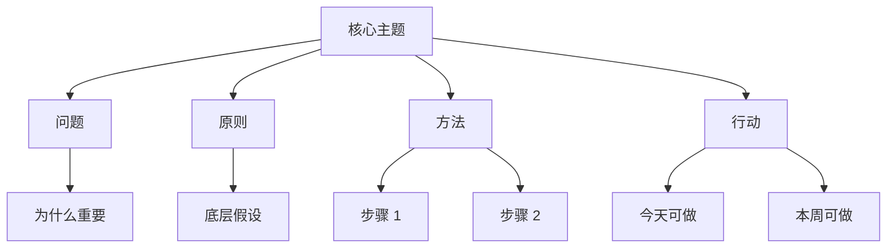

# {{video_title}}

## 一句话总结

{{one_sentence_summary}}

## 来源信息

- 频道：Dan Koe
- 链接：{{video_url}}
- 发布时间：{{published_date}}
- 学习日期：{{date}}
- 字幕依据：{{transcript_basis}}

## 核心观点

1. {{key_point_1}}
2. {{key_point_2}}
3. {{key_point_3}}

## 视觉知识信息图

> 推荐生成一张 `assets/YYYY-MM-DD-video-slug.svg`，采用手绘视觉笔记风格：中文大标题、暖橙高亮、黑色手绘线条、中心树/路径结构、图标化模块、少量关键词说明。图片生成后在这里嵌入：

```markdown
![[assets/YYYY-MM-DD-video-slug.svg]]
```

## Mermaid 草图



## 详细学习笔记

### 1. 问题背景

### 2. 关键机制

### 3. 方法步骤

### 4. 例子与比喻

### 5. 我的理解

## 可执行行动

- [ ] 
- [ ] 
- [ ] 

## 可拆分的原子笔记建议

- [[待确认概念]]

## 与我的系统连接

- 内容创作：
- 一人公司：
- 学习系统：
- Obsidian 知识库：

## 待复盘问题

- 这个视频中最值得实践的一件事是什么？
- 它和我当前的账号/产品/学习目标有什么关系？
- 哪个观点需要二次验证？
