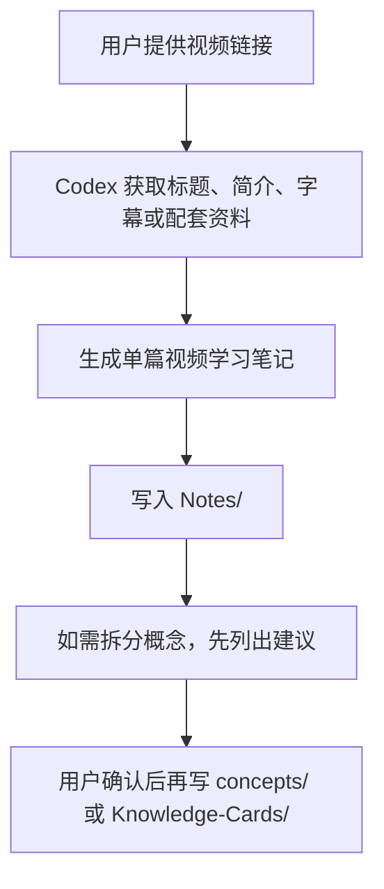

# Codex 与 Hermes 协作边界

## 一句话原则

Hermes 是 Obsidian 知识库的主自动化系统；Codex 只做用户明确触发的单次协作，不创建新的后台自动流。

## 当前主系统

根据 [[obsidian-manual]]，现有知识库已经具备：

- Windows Obsidian 作为本地写作入口。
- Obsidian Git 每 5 分钟同步到 GitHub。
- Hermes Agent / WSL 侧定期同步和整理。
- Annotation Marker 批注进入 `audit/new/`。
- 用户说“执行 audit”后，由 AI 读取、修正并归档到 `audit/resolved/`。

这意味着知识库已经有主干流程，Codex 不应重复搭建第二套自动同步、监听或批量整理系统。

## Codex 的允许职责

Codex 适合做这些受控任务：

- 根据用户给定链接生成单篇视频学习笔记。
- 把临时研究结果写入 `Notes/`、`raw/` 或 `audit/new/`。
- 在用户明确授权后，修改单个指定文件。
- 辅助检查 Git 状态、冲突、乱码、链接失效和 frontmatter 问题。
- 为 Hermes 生成待处理材料，而不是绕开 Hermes 直接重构主知识库。
- 在用户明确要求时，按 [[4Profile协作指南]] 作为 `builder` 执行技术搭建任务。

## Codex 的禁止行为

除非用户单独明确授权，Codex 不做以下操作：

- 不安装或启用新的 Obsidian 插件。
- 不创建 cron、计划任务、文件监听器或后台 Agent。
- 不批量移动、重命名、删除知识库文件。
- 不自动改 `index.md`、`SCHEMA.md`、`任务控制中心.md` 的核心结构。
- 不直接处理 `audit/new/` 中所有任务，除非用户说“执行 audit”。
- 不与 Hermes 同时维护同一篇概念页或实体页。
- 不改 Hermes 的 Git 同步、批注转换、WSL 脚本或远程仓库设置。

## 推荐目录分工

| 目录 | 主负责人 | Codex 使用方式 |
|---|---|---|
| `audit/new/` | Hermes / 审核流程 | 只放待审材料或按用户要求处理 |
| `audit/resolved/` | Hermes / 审核流程 | 不主动写入，除非执行 audit |
| `concepts/` | Hermes 主维护 | 只在用户明确要求时新增或小改 |
| `entities/` | Hermes 主维护 | 只在用户明确要求时新增或小改 |
| `Knowledge-Cards/` | Hermes / Writer | Codex 可生成草稿，但优先放待审区 |
| `Notes/` | 用户 / Codex 临时协作 | 可放视频总结、研究笔记、会议笔记 |
| `raw/` | 来源材料 | 可保存转录、原始链接摘要、抓取材料 |
| `Synthesis/` | Hermes 主维护 | Codex 不主动改综合洞察 |

## 视频学习工作流

结合 [[obsidian-ai-integration-video]]，视频内容进入知识库时采用低冲突流程：



默认不直接改概念页。重要视频先进入 `Notes/`，再由用户决定是否升级为概念页、知识卡片或 audit 任务。

## 写入前检查清单

Codex 每次写入 Obsidian 前应检查：

- 是否是用户明确要求的本次任务。
- 是否会触碰 Hermes 管理的自动化流程。
- 是否只影响少量指定文件。
- 是否已保留来源链接和创建日期。
- 是否需要写入 `log.md`。
- 如果涉及 `concepts/`、`entities/`、`Synthesis/`，是否得到用户明确确认。

## 推荐提示词

### 视频入库

```text
把这个视频整理成 Obsidian 笔记，只写入 Notes/，不要改 concepts、index、Synthesis。
如果你认为值得拆成概念页，先列建议，等我确认。
```

### 审核闭环

```text
执行 audit：只处理 audit/new/ 中和本次主题相关的文件，处理前列出将修改哪些文件。
```

### 技术搭建

```text
按 builder 角色处理这个搭建任务。不得创建后台任务，不得改 Hermes 同步脚本，除非我明确授权。
```

## 失败保护

如果 Codex 发现当前任务可能与 Hermes 冲突，应暂停写入并说明：

- 可能冲突的文件或流程。
- 建议由 Hermes 处理还是由 Codex 单次处理。
- 如果由 Codex 处理，需要用户确认的改动清单。

## 相关链接

- [[obsidian-manual]]
- [[hermes-agent]]
- [[llm-wiki-pattern]]
- [[obsidian-ai-integration-video]]
- [[4Profile协作指南]]
